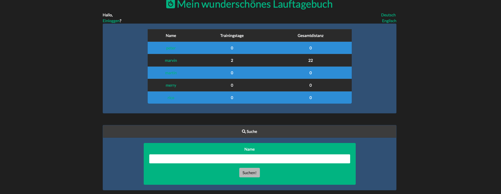

# Run diary with symfony

This is a multiuser run diary with several entries builded with symfony.

## Preview



## Development setup 
At first you've to run: 
```
composer install --dev
```
to install all dependencies including development packages.


## Apply enviroment variables
We've to create some enviroment variables for symfony so the framework knows e.g. where the database should be saved into. To create this enviroment variables please run: 
```
source .env.test
```
### Loading mock data into database
For creating database using the provided entity metadata as schema and add some mock data, please run following commands: 
```
php bin/console doctrine:schema:update --force
php bin/console doctrine:fixtures:load  
```

### Start local php server
```
php -S 127.0.0.1:8000 -t public
```

### Running tests
To run through all the included tests just run the following command:
```
./bin/phpunit
```
## Good to know
Beside the obviously existing functionality of the web app, there's a small API which allows you to fetch user data in json or csv file format.
You simply have to call:
```
/profile/<your_profile_name>/diary.json
/profile/<your_profile_name>/diary.csv
```
- Note: You've to be logged in to use this service.
